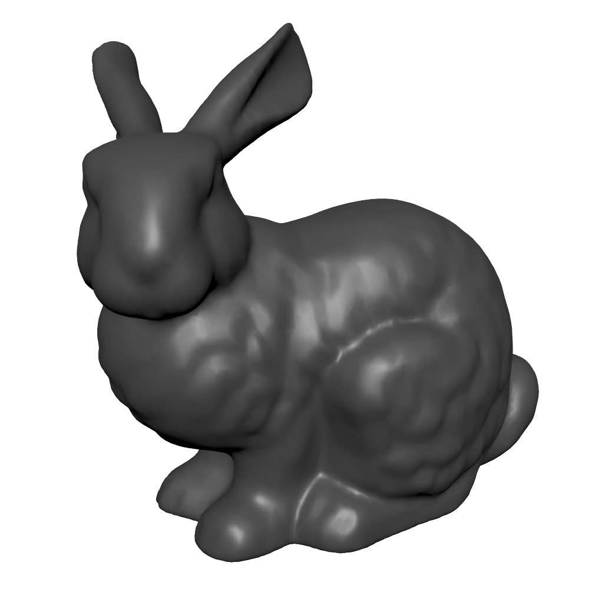
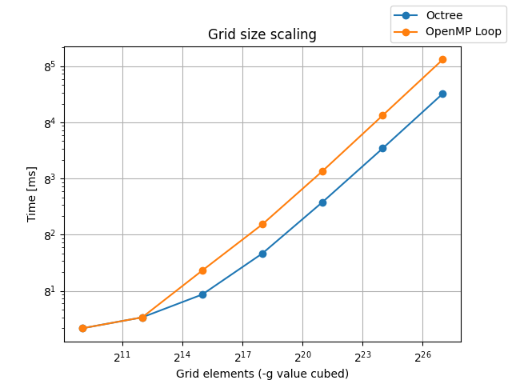
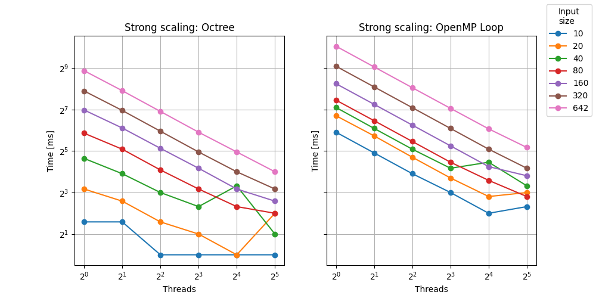
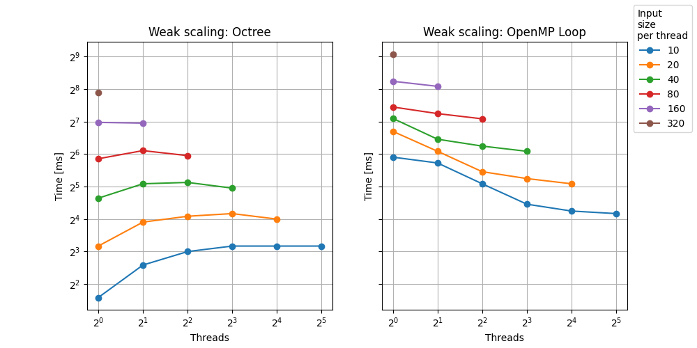

# AVS 2 - Parallel marching cubes

- Author: Ondřej Vlček (xvlcek27)

## Structure
    common          - reference single-threaded solution
    data            - point clouds
    paralle_builder - multithreaded and task-based solution
    scripts         - testing scripts

## Compilation on the cluster

    ml intel-compilers/2022.1.0 CMake/3.23.1-GCCcore-11.3.0
    mkdir build && cd build
    CC=icc CXX=icpc cmake ..
    make -j

## CLI Arguments

    -l, --level arg   - Iso-surface value (0.15)
    -g, --grid arg    - Grid size (64)
    -b, --builder arg - Calculator name, one of [ref, loop, tree] (ref)
    -t, --threads arg - Number of OpenMP threads (0)
        --batch       - Silent mode
    -h, --help        - Print help

## Results

### Grid scaling

### Strong scaling
 

### Weak scaling
 